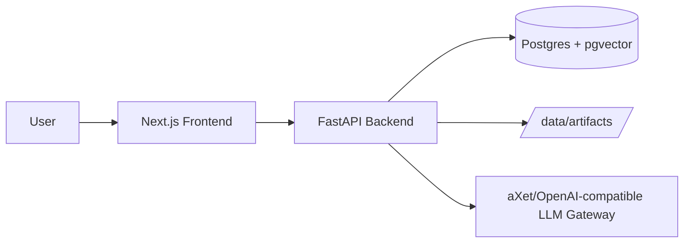

# Architecture Overview

## System Context
The platform is a local-first regulatory reporting workbench with workflow governance:
- Frontend (Next.js) provides persona-based views for BA, DEV, and REVIEWER.
- Backend (FastAPI) orchestrates ingestion, AI interactions, workflow transitions, and artifact lifecycle.
- Postgres stores artifacts, run outputs, workflow state/history, job state, and RAG chunks.
- Local filesystem stores uploaded and generated files under `data/artifacts`.
- External LLM gateway handles chat completions.

## Runtime Topology

## Backend Composition
The backend is route-modular and domain-oriented:
- `routes/system_routes.py`: health and generic LLM proxy endpoints
- `routes/artifact_routes.py`: artifact upload/list/download/delete/restore
- `routes/ba_routes.py`: gap analysis, remediation, PSD comparison, context chat
- `routes/dev_routes.py`: SQL generation and report XML linkage
- `routes/reviewer_routes.py`: XML generation and validation
- `workflow_routes.py`: workflow lifecycle, quality gates, stage transitions, functional-spec persistence
- `routes/admin_routes.py`: instruction management, admin audit, synthetic data loading, workflow admin utilities

## Data Model (Core Tables)
- `artifacts`: uploaded and generated files with extracted metadata
- `analysis_runs`: stage outputs and diagnostics
- `workflows`: current stage, assignee context, latest stage artifacts/runs
- `workflow_stage_history`: immutable transition and action history
- `job_queue`: background job lifecycle and progress
- `rag_chunks`: extracted FCA text chunks with optional vectors
- `agent_instructions`, `admin_audit_logs`: admin governance

## Workflow Model
The canonical stage path is:
- `BA` -> `DEV` -> `REVIEWER` -> `COMPLETED`

Key controls:
- Stage exit gates enforce readiness before submit.
- Send-back path supports structured reason codes and comments.
- BA can finalize and persist a functional specification artifact (JSON or CSV) from a gap run.
- Versioning can create a new workflow from a prior one with optional carry-forward context.

## Design Principles
- Keep orchestration centralized in one backend service for local reliability.
- Persist inputs and outputs at each stage for traceability.
- Use deterministic checks around LLM output to prevent silent quality regressions.
- Keep background work visible through database-backed job state instead of hidden in transient in-memory status.
- Separate workflow governance from agent execution to keep behavior explainable.
