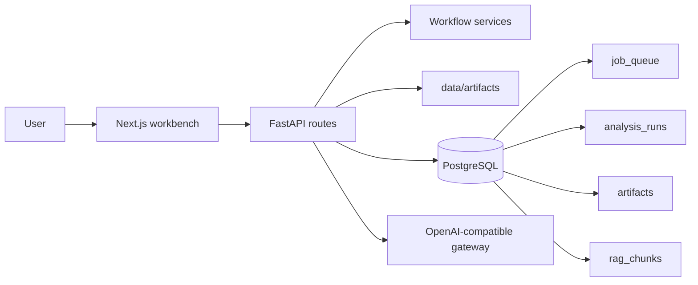
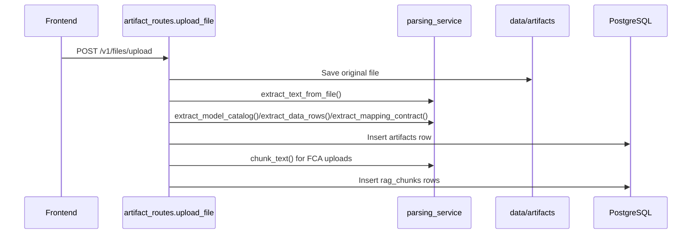
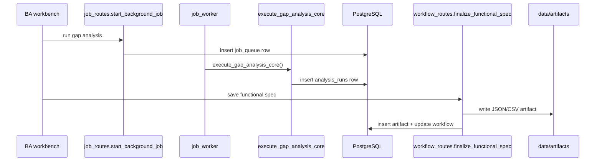
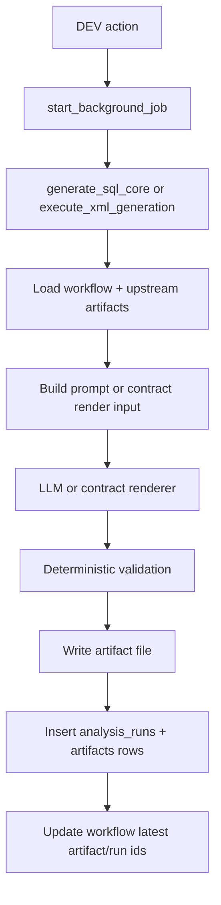
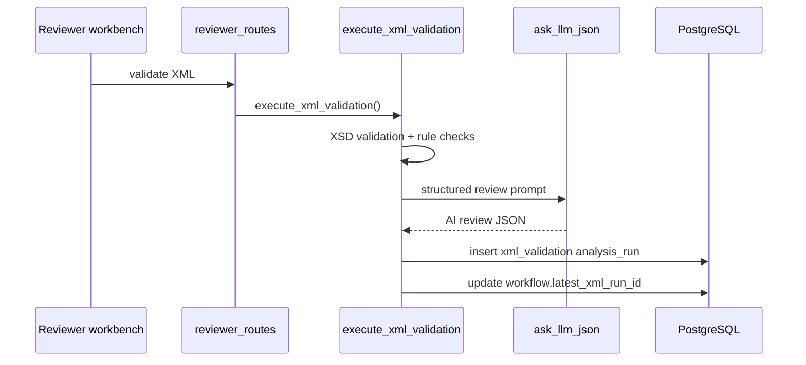

# Developer Flow Reference

## Purpose
This guide explains the live application flow from a software engineer's point of view. It focuses on which route is called, which service owns the work, what is stored, and how the LLM is used.

## Read This First
- Frontend entry: `frontend/components/workbench.tsx`
- Backend entry: `backend/app/main.py`
- Workflow lifecycle: `backend/app/workflow_routes.py`
- Artifact ingestion: `backend/app/routes/artifact_routes.py`
- Background jobs: `backend/app/routes/job_routes.py`, `backend/app/services/job_service.py`, `backend/app/services/job_worker.py`

## Runtime Map

## Where Data Lives
| Concern | Primary store | Notes |
| --- | --- | --- |
| Workflow state | `workflows` table | Current stage, assignee, latest run/artifact ids |
| Workflow history | `workflow_stage_history` table | Immutable stage and action history |
| Uploaded/generated files | `data/artifacts/<project_id>/` | Real file bytes stay on disk |
| Artifact metadata | `artifacts` table | File path, kind, display name, extracted text/json |
| Stage outputs | `analysis_runs` table | Gap analysis, SQL generation, XML generation, validation |
| Background jobs | `job_queue` table | Pending/running/completed/failed job state |
| Retrieval chunks | `rag_chunks` table | Text chunks and lookup metadata for FCA/model matching |

## Artifact Upload Flow
When a user uploads FCA, model, data, XSD, or mapping-contract input:

1. Frontend calls `uploadArtifact` from `frontend/components/workbench/actions/artifactActions.ts`.
2. Backend receives `POST /v1/files/upload` in `backend/app/routes/artifact_routes.py`.
3. The file is saved under `data/artifacts/<project_id>/`.
4. `extract_text_from_file()` and kind-specific parsers in `backend/app/services/parsing_service.py` build:
   - `extracted_text`
   - `extracted_json` when structured parsing is available
5. A new `Artifact` row is written to PostgreSQL.
6. If the artifact kind is `fca`, `chunk_text()` splits the extracted text into overlapping chunks and stores them in `rag_chunks`.

## Why Chunking Exists
Chunking is used for two practical reasons:
- It keeps long FCA documents small enough to reuse in prompts and lookup operations.
- It lets the app keep retrieval context at paragraph-sized boundaries instead of forcing the LLM to read a full source document every time.

Current implementation details:
- Chunking happens in `chunk_text()` in `backend/app/services/parsing_service.py`.
- Chunks are stored in `rag_chunks`.
- The system also stores model-field and required-field lookup rows through `backend/app/services/vector_service.py`.
- The backend now persists deterministic embeddings for FCA chunks and shortlist rows, backfills missing embeddings at startup, and uses pgvector cosine-distance ranking before lexical fallback.

## BA Flow: Gap Analysis and Functional Spec
### Gap analysis
1. Frontend calls the async BA action from `frontend/components/workbench/actions/agentRunActionsAsync.ts`.
2. Backend receives `POST /v1/gap-analysis/run-async` in `backend/app/routes/ba_routes.py`.
3. `start_background_job()` creates a `job_queue` row.
4. `backend/app/services/job_worker.py` executes `execute_gap_analysis_core()` from `backend/app/services/ba_gap_orchestration_service.py`.
5. Gap results are stored in `analysis_runs`.
6. The frontend reloads the run through `loadWorkflowGapData()` in `frontend/components/workbench/actions/workflowStateHelpers.ts`.

### Functional specification save
1. BA saves the approved mapping result from the action panel.
2. Backend receives `POST /v1/workflows/{workflow_id}/functional-spec`.
3. `write_functional_spec_file()` writes the JSON or CSV file.
4. `build_functional_spec_artifact()` creates the artifact metadata.
5. The workflow is updated with `latest_gap_run_id` and `functional_spec_artifact_id`.

## DEV Flow: SQL and XML Package Generation
### SQL generation
1. Frontend calls `POST /v1/sql/generate-async`.
2. Background execution lands in `generate_sql_core()` in `backend/app/services/sql_generation_service.py`.
3. The service loads workflow state, gap rows, and the selected data model artifact.
4. The LLM receives condensed gap rows, model schema, and optional developer guidance.
5. Deterministic validation in `backend/app/services/sql_service.py` repairs or rejects unsafe SQL.
6. The SQL file is written to disk and registered as a `generated_sql` artifact.

### XML package generation
1. Frontend calls `POST /v1/dev/report-xml/generate-async`.
2. Background execution lands in `execute_xml_generation()` in `backend/app/services/xml_review_orchestration_service.py`.
3. The service loads source data rows, XSD hints, FCA text when selected, and the functional specification.
4. If the report code is recognized, `render_contract_xml()` in `backend/app/services/xml_contract_service.py` uses the filing-specific mapping contract.
5. Otherwise the LLM generates XML from prompt context, then the service repairs obvious shape issues and validates against the XSD.
6. The XML file is written to disk and stored as a `generated_xml` artifact.
7. DEV can explicitly link that artifact to the workflow through `POST /v1/dev/report-xml/link`.

## Reviewer Flow: XML Validation and Completion
1. Frontend calls `POST /v1/xml/validate-async`.
2. Background execution lands in `execute_xml_validation()` in `backend/app/services/xml_review_orchestration_service.py`.
3. The service loads the linked XML artifact, XSD, optional FCA artifact, data artifact, model artifact, and functional specification.
4. The service performs:
   - XSD validation with `xmlschema`
   - heuristic or contract-aware rule checks
   - AI review summarization with `ask_llm_json()`
5. A compact validation payload is written to `analysis_runs`.
6. The workflow’s `latest_xml_run_id` is updated.
7. Reviewer submits or sends back using `submit_workflow_stage()` or `send_back_workflow_stage()` in `backend/app/services/workflow_service.py`.

## Context Chat Flow
1. Frontend sends the question through `runContextChatAction.ts`.
2. Backend receives `POST /v1/chat/context`.
3. `artifact_context_text()` in `backend/app/services/context_service.py` builds a bounded text bundle from selected artifacts.
4. The prompt sent to the LLM contains:
   - optional user guidance
   - artifact text/json excerpts
   - the user question
5. The answer is returned directly to the frontend chat panel.

This path currently uses artifact text aggregation, not a full semantic vector search pipeline.

## How Prompts Work
Prompts are assembled from three layers:
- base agent prompts from `app.constants.AGENT_DEFAULT_PROMPTS`
- admin overrides via `active_instruction()` and the `agent_instructions` table
- request-specific context built by the stage service

Typical pattern:
1. Route validates ids and workflow access.
2. Service loads artifact text/json and workflow state.
3. Service builds a system prompt and a user prompt.
4. `ask_llm_json()`, `ask_llm_text()`, or `call_axet_chat()` calls the configured gateway.
5. Deterministic validation runs before the result is treated as accepted output.

## Why PostgreSQL Is Involved
PostgreSQL is central to the app:
- workflow state is stored there
- artifact metadata is stored there
- stage outputs are stored there
- background jobs are stored there
- retrieval chunks are stored there
- admin configuration and audit history are stored there

The file bytes themselves are still stored on disk, and the database keeps the lookup path.

## pgvector Status
The stack uses a pgvector-capable PostgreSQL image and the startup probe confirms the extension is available. The backend aligns `rag_chunks.embedding` to pgvector storage, persists deterministic embeddings for new rows, backfills older rows when startup runs, and uses pgvector ordering for candidate retrieval and RAG search. Lexical fallback remains in place as a resilience path if vector ordering is temporarily unavailable.

## Why Redis Is Not Part Of The Active Runtime
Redis is not used by the current code path:
- jobs are stored in the `job_queue` table
- job progress is polled from PostgreSQL
- background execution is handled by FastAPI background tasks and the polling worker

Because there is no cache or queue feature depending on Redis today, the local stack no longer starts Redis by default.

## Download And Artifact Selection Flow
- Download buttons call artifact or run download endpoints such as:
  - `/v1/artifacts/{artifact_id}/download`
  - `/v1/sql/{run_id}/download`
  - `/v1/xml/{run_id}/download`
  - `/v1/workflows/{workflow_id}/functional-spec/download`
- Backend resolves the artifact row, reads the file from disk, and streams it back with `FileResponse` or `StreamingResponse`.
- Workflow-aware download actions also write audit entries through `log_workflow_action()`.

## Files To Trace For Each Persona
- BA: `backend/app/routes/ba_routes.py`, `backend/app/services/ba_gap_orchestration_service.py`
- DEV: `backend/app/routes/dev_routes.py`, `backend/app/services/sql_generation_service.py`, `backend/app/services/xml_review_orchestration_service.py`
- Reviewer: `backend/app/routes/reviewer_routes.py`, `backend/app/services/xml_review_orchestration_service.py`
- Workflow controls: `backend/app/workflow_routes.py`, `backend/app/services/workflow_service.py`
- Frontend orchestration: `frontend/components/workbench/`, especially `actions/`, `WorkflowHome.tsx`, and `WorkbenchDashboard.tsx`
